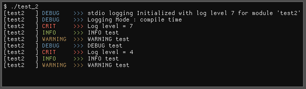
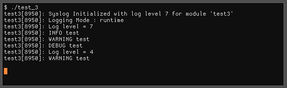

`<cstdio>` mode

`<syslog.h>` mode

---

This is a simple little logging abstraction that aims to soley be a playground for a small obsession with logging and the fact that I have everyone elses attempt at logging. 

The library works by creating a `liblogging_<module>.a` with a set of defines listed below.

***BUG***  You can only currently create a single module due do the inability to concatenate header-guard values... maybe I'll find a solution soon. Otherwise, I might have to generate header-guards - *shudder*.

---

###Here is how it works: 

If `LOGGING_COMPILETIME` is defined, then `logging.hh` will include `logging_compile_time.hh`. This means that `void set_log_level(LogLevel)` will do nothing to effect the actual logging - though the function may have side effects.

If `LOGGING_RUNTIME` is defined, then `logging.hh` will include `logging_runtime.hh`. `void set_log_level(LogLevel)` will/must effect the decision to log. This has branch overhead to check if `write_log<L>(...)` can log.

If `LOGGING_SYSLOG` is defined, then `logging.cpp` will include `logging_syslog.impl`. This file implements the manadory functions to use syslog.

If `LOGGING_STDIO` is defined, then `logging.cpp` will include `logging_stdio.impl`. This file implements the manadory functions to use stdio logging - like `fprintf(stderr,...)`. This will attempt to uses an ANSI colored tag when logging to a console, but avoid the colors when the log destination is directed to a non-tty (like a file, think `./a.out > log`).

---

### Makefile madness

In `Makefile` (a work in progress), my goal is to distribute a makefile function/define that will build a logging module for a specific set of specifications and name. So `liblogging_mycore.a`, for example, will have some either `STDIO` or `SYSLOG` logging AND would be `runtime` or `compiletime`, but `liblogging_myplugin.a` , for example, would have other options.